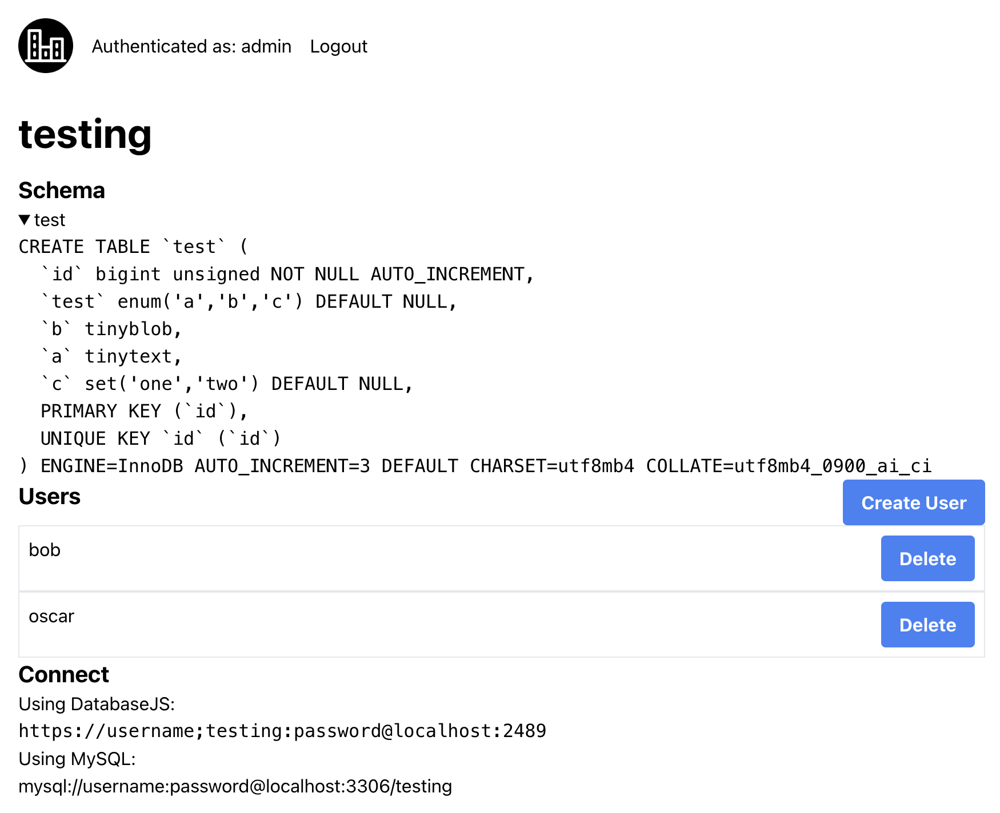

# Cityscale

> [!WARNING]  
> This project is in early development. It may not have all documented features and it's web UI is still very ugly.

The MySQL database platform for side projects.

### Features

 - Create database and users from web UI
 - Create and merge database branches (similar to Planetscale)
 - Create and manage database backups to S3-compatible storage
 - Edge runtime support via full compatibility with [`@planetscale/database-js`](https://github.com/planetscale/database-js)
 - Cheap to and easy to operate (one click deploy for less than 5$ a month on [Railway](https://railway.app))

### Dashboard

Cityscale comes with a web dashboard to manage your databases.

<div style="display: flex; flex-direction: column; align-items: center;">
    
</div>

### Deployment Guide

### Railway

> [!WARNING]  
> Coming soon...

### Docker

You can deploy to any server with Docker installed using the following command:

```bash
docker volume create cityscale-data
docker run -d -p 2489:2489 -p 3306:3306 -v cityscale-data:/data ghcr.io/oscartbeaumont/cityscale:latest
```

Now to go to `http://localhost:2489` and you should be able to login with the default credentials (username and password both `admin`).

#### Development

To develop Cityscale you must have [Rust](https://www.rust-lang.org), [Docker](https://www.docker.com), [pnpm](https://pnpm.io) and [Node.js](https://nodejs.org) installed.

```bash
pnpm -C web install
./dev.sh run
```